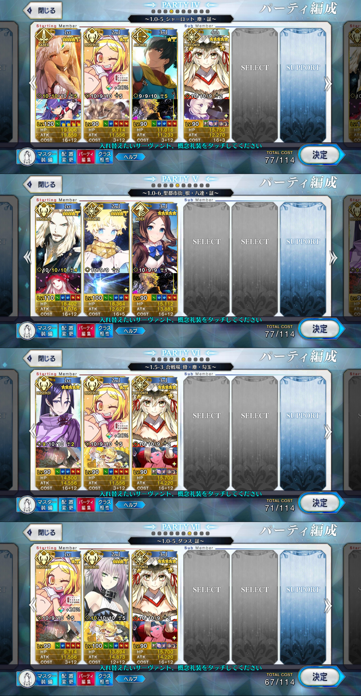

# Twitterプロフィール <!-- omit in toc -->

プレイしているゲームはFGOのみです。

# 1. プレイスタイル

推し鯖を必ず編成に組み込んで、気ままに周回報告しています。

遂に所持鯖242騎のスキルマを達成できました。
次はAS2マを目指して周回していきます。

# 2. 周回報告集計

[fgo-farm-report-collection](https://github.com/silverag-corgi/fgo-farm-report-collection)
で周回報告を機械的に収集・集計し、Webで公開しています。

1. クエスト種別ごとの月間周回数(ユーザ編)
   - [スプレッドシート版](bit.ly/frusrss)
   - [Webサイト版](bit.ly/frusrws)
2. クエスト種別ごとの月間周回数(クエスト編)
   - [スプレッドシート版](bit.ly/frqstss)
   - [Webサイト版](bit.ly/frqstws)

※クエスト種別には「通常クエ、イベクエ、全てのクエスト」の3種類があります。

# 3. プレイ実績

## 3.1. 全般

| 項目         |         | 備考                         |
| ------------ | ------- | ---------------------------- |
| マスレベ     | 160     | 2021/05/05達成               |
| スキルマ     | 242     | 2022/03/30所持鯖スキルマ達成 |
| 絆マ         | 78      | 2022/03/16                   |
| 100礼装      | 24      | 2022/03/20                   |
| プレイ開始月 | 2016/02 |                              |

## 3.2. 箱イベ実績

| 開催年 | 箱数(春) | 箱数(夏) | 箱数(冬) | 備考       |
| ------ | -------: | -------: | -------: | ---------- |
| 2016   |        - |        - |        - | 未記録     |
| 2017   |        - |       42 |       44 |            |
| 2018   |        - |      453 |      259 |            |
| 2019   |        - |        0 |      333 | 夏は未参加 |
| 2020   |        - |      666 |      500 |            |
| 2021   |        - |     7579 |      503 | 夏は新形式 |
| 2022   |      101 |        - |        - |            |

## 3.3. レイド実績

| イベント     | ボス         | 討伐数(初回)                                     | 討伐数(復刻) |
| ------------ | ------------ | ------------------------------------------------ | ------------ |
| 事件簿コラボ | バルバトス   | 352                                              | 515          |
| ツングースカ | イヴァン雷帝 | 93                                               |              |
|              | スルト       | 160                                              |              |
|              | エネミー6種  | 92                                               |              |
|              | ビースト4    | 320(3体撃破50、5体撃破101、7体撃破150、未集計19) |              |

## 3.4. 周回実績

2021年の周回実績です。

| 報告年月 | 周回数(通常クエ) | 周回数(イベクエ) | 周回数(合計) |
| -------- | ---------------: | ---------------: | -----------: |
| 2021/01  |                0 |              200 |          200 |
| 2021/02  |              100 |              300 |          400 |
| 2021/03  |             1170 |              150 |         1320 |
| 2021/04  |             1000 |              200 |         1200 |
| 2021/05  |              850 |              350 |         1200 |
| 2021/06  |              150 |                0 |          150 |
| 2021/07  |                0 |              350 |          350 |
| 2021/08  |              250 |              293 |          543 |
| 2021/09  |                0 |             1134 |         1134 |
| 2021/10  |                0 |                0 |            0 |
| 2021/11  |              200 |              151 |          351 |
| 2021/12  |             1014 |             2189 |         3203 |

全ての周回実績は以下のリンクで確認してください。
  - [FGO Harvest - 周回報告自動収集](https://fgojunks.max747.org/harvest/contents/user/silverag_corgi.html)

# 4. 推し鯖

# 5. 好きなクエと編成

推し鯖入れたい！でも速度も出したい！って気持ちを編成に組み込んでます。

